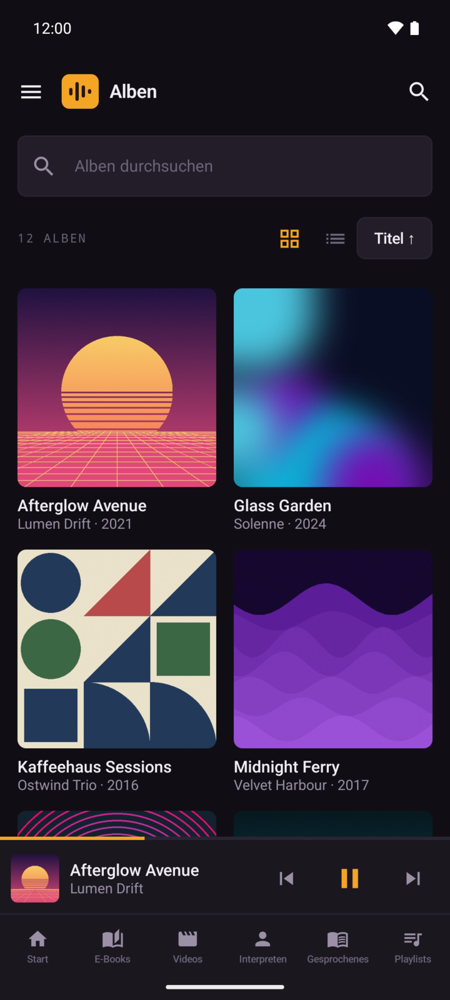
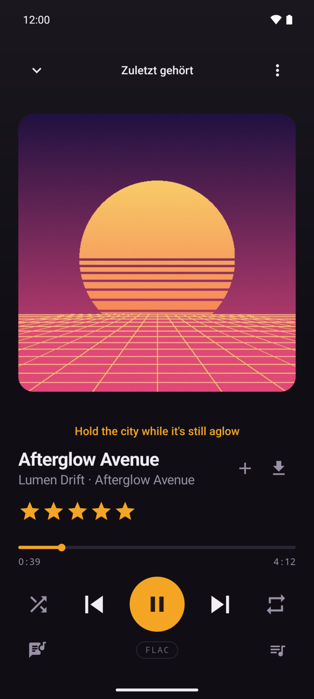
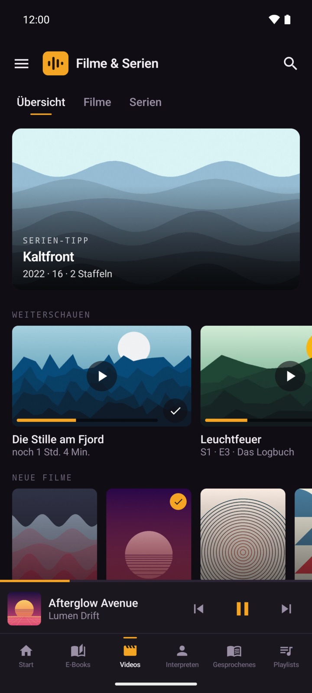

# Sonorus für Android

Nativer Android-Client für [Sonorus](https://github.com/flopsyan/sonorus), den
selbst gehosteten Mediaplayer. Die App braucht einen laufenden Sonorus-Server.

<p>
  
  
  
</p>

## Funktionen

- Die ganze Bibliothek des Servers: Musik, Podcasts, Hörbücher, Hörspiele,
  E-Books, Filme und Serien.
- **Downloads** von Songs, Alben, Playlists, Folgen, Büchern, Filmen und ganzen
  Staffeln. Ohne Verbindung startet die App direkt in die Downloads.
- **Offline weiter nutzbar**: Bewertungen, Playlist-Änderungen und Fortschritt
  werden nachgereicht, sobald der Server wieder erreichbar ist.
- **Android Auto**, mit Sprachsuche.
- **Qualität pro Gerät**, getrennt für Streamen und Downloads, verlustfrei auf
  Wunsch nur im WLAN.
- **Schmale Leiste im geteilten Bildschirm**, etwa neben der Navigation.

## Bauen und installieren

Das APK wird aus dem Quelltext gebaut. Voraussetzung sind JDK 21 und das
Android-SDK.

Android installiert nur signierte APKs. Dafür gehört eine `keystore.properties`
ins Projektverzeichnis (steht in `.gitignore`):

```properties
storeFile=/pfad/zu/sonorus-release.keystore
storePassword=<passwort>
keyAlias=sonorus
keyPassword=<passwort>
```

Einen neuen Schlüssel erzeugt
`keytool -genkeypair -v -keystore sonorus-release.keystore -alias sonorus -keyalg RSA -keysize 2048 -validity 10000`.
Geht er verloren, lässt sich die App nicht mehr aktualisieren, nur neu
installieren.

```bash
export JAVA_HOME=/pfad/zu/jdk21
export ANDROID_HOME=/pfad/zum/android-sdk
./gradlew assembleRelease
adb install -r app/build/outputs/apk/release/app-release.apk
```

Ohne `adb` lässt sich das APK auch aufs Handy kopieren und dort öffnen.

Beim ersten Start fragt die App nach Serveradresse, Benutzername und Passwort.
Die Adresse muss mit HTTPS erreichbar sein.
